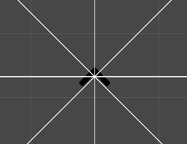

# Genetic Follow

Simple neural network with genetic mutation algorithm that follows dot.

## How it works?

## Authors

* **Sebastian Waluś** - [R1per](https://github.com/R1per)

## Acknowledgments

* Hat tip to anyone whose code was used
* Inspiration
* etc
