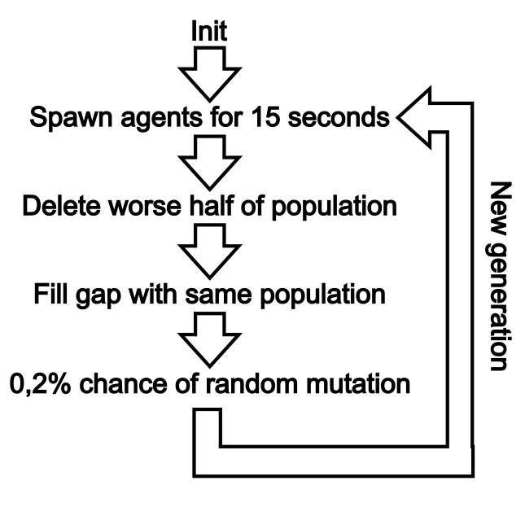

# Genetic Follow

Simple neural network with genetic mutation algorithm that follows dot.

## How it works?
This is how network looks like:

It consists of 8 inputs

which return float value of a distance between Agent and a Dot, if there is no Dot in sight then returns zero.
Then there are 3 layers of neurons. First two are 10 neurons + 1 bias neuron, third layer is one output neuron. Two hidden layers are probably an overkill for this type of simple ai, but the more, the more precise network can be.

Networks routine works like this:

## Authors

* **Sebastian Waluś** - [R1per](https://github.com/R1per)

## Acknowledgments

* Hat tip to anyone whose code was used
* Inspiration
* etc
